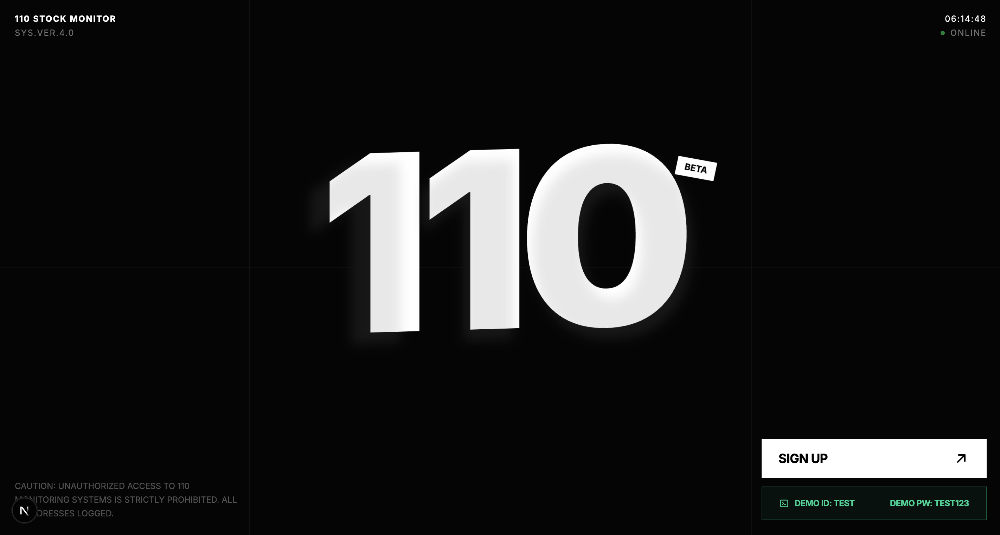
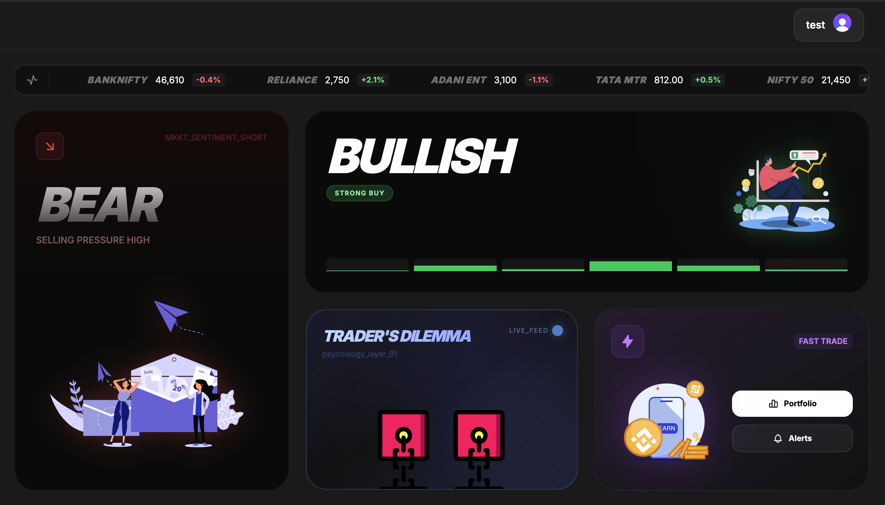
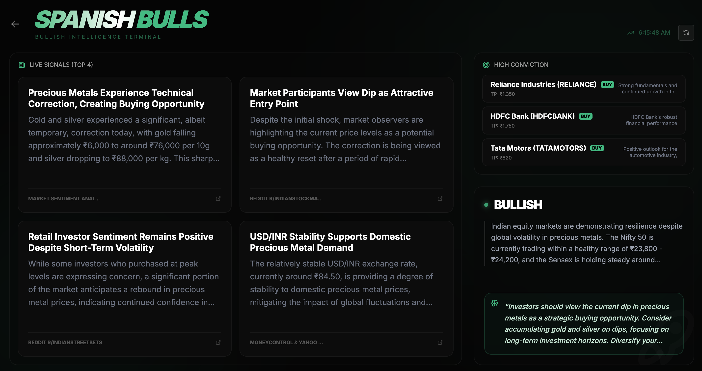
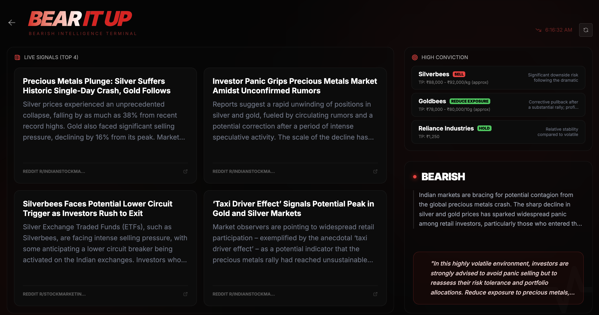
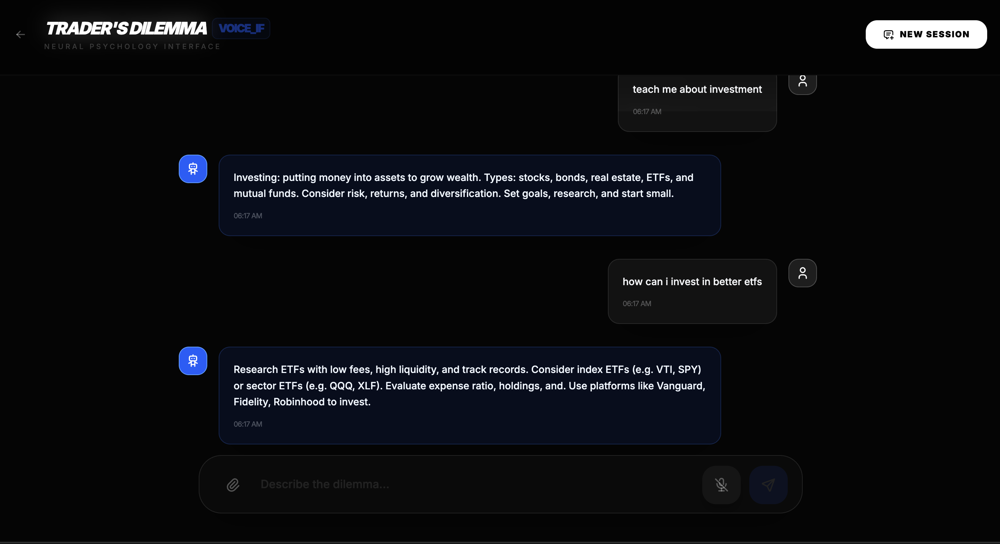
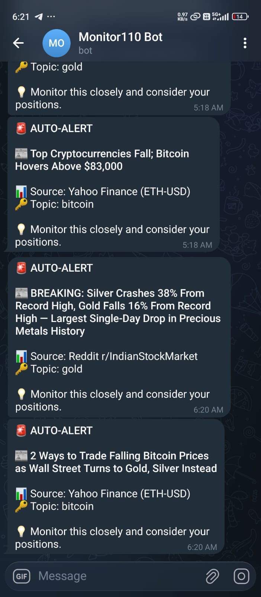

# MONITOR 110: THE SENTIMENT COMMAND CENTER

### [LIVE PROTOTYPE](https://fail-exe-hackathon-prototype-mvx2.vercel.app/)

MONITOR 110 is a high-performance financial intelligence terminal engineered for low-latency market analysis. It bridges the gap between raw quantitative data and qualitative market psychology through temporal sentiment mapping and a high-fidelity, interruptible voice interface.

---

## EXECUTIVE VISUAL OVERVIEW



---

## CORE CAPABILITIES

### 1. HIGH-FIDELITY SENTIMENT TERMINAL
The main dashboard utilizes a custom-engineered visual layer to represent market volatility. By integrating Lottie-driven liquid animations and Framer Motion state transitions, the UI physically reacts to market shifts in real-time.



### 2. TEMPORAL SENTIMENT ANALYSIS
The engine splits market intelligence into distinct temporal layers, allowing for precise identification of accumulation and distribution phases.

* **BULLISH SENTIMENT LAYER:** Tracks aggressive buying pressure and liquidity inflow through high-intensity visual pulses.
* **BEARISH SENTIMENT LAYER:** Identifies distribution patterns and selling pressure using high-contrast visual cues for rapid decision-making.

<div align="center">
  
  
</div>

### 3. INTERRUPTIBLE VOICE INTELLIGENCE
A fully functional, turn-based financial assistant designed for hands-free operation. The system features low-latency, interruptible voice chat, allowing users to query complex financial data and receive spatial analysis without manual input.



### 4. AUTOMATED TELEGRAM SURVEILLANCE
A robust alert system that monitors watchlisted ETFs and precious metals. The system triggers instant notifications for significant price movements, ensuring zero-latency awareness of market crashes or breakouts.



---

## TECHNICAL ARCHITECTURE

### REPOSITORY STRUCTURE

* **/javascript-frontend:** A Next.js 14 application leveraging "use client" for high-performance state management and ultra-smooth UI transitions.
* **/PythonBackend:** A dedicated Python engine handling real-time data processing, requirements management, and temporal logic.

---

## THE TECH STACK

| COMPONENT | TECHNOLOGY |
| :--- | :--- |
| **Frontend Framework** | Next.js 14 (App Router) |
| **Animation Engine** | Framer Motion + Lottie-React |
| **Styling** | Tailwind CSS (Ultra-Dark Glassmorphism) |
| **Authentication** | Clerk Integration |
| **Backend** | Python 3.x |
| **Alerting** | Telegram Webhook API |

---

## ASSETS USED 
I have utilised LottieJson Animation created by Skilled users like : 
https://iconscout.com/contributors/graphic-room
https://iconscout.com/contributors/danimotion
https://iconscout.com/contributors/graphichup
https://iconscout.com/contributors/nanoagency
check them out !!

## INSTALLATION AND SETUP

### FRONTEND DEPLOYMENT
```bash
cd javascript-frontend
npm install
npm run dev